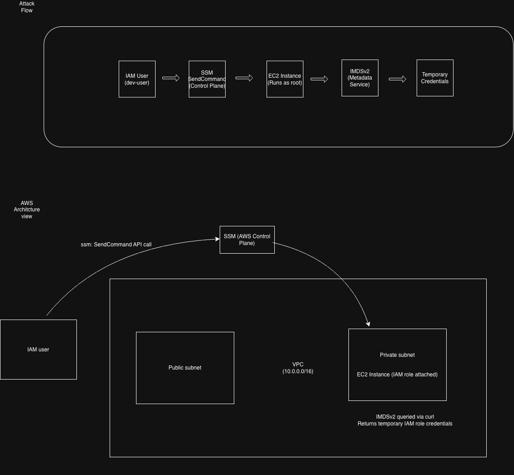

# AWS IAM Attack Path Lab

## Overview

This lab explores AWS IAM attack paths in an authorised personal lab environment. It focuses on how specific IAM permissions can create privilege escalation or remote command execution paths, and how least-privilege design can reduce blast radius.

The lab currently models two high-risk AWS attack paths:

1. `ssm:SendCommand` used as remote command execution against an EC2 instance.
2. `iam:PassRole` combined with `ec2:RunInstances` to launch compute with a more privileged role.

## Objective

- Understand how IAM permissions define cloud blast radius.
- Model realistic AWS attack paths from a low-privileged identity.
- Analyse how EC2 instance metadata can expose temporary role credentials.
- Identify dangerous permission combinations.
- Redesign permissions using least privilege and guardrails.
- Document attacker-to-defender lessons clearly.

## Attack Path 1: SSM Run Command

### Flow

```text
IAM user
  → ssm:SendCommand
  → EC2 instance executes command
  → IMDSv2 queried from inside instance
  → temporary IAM role credentials retrieved
```

### Why it matters

`ssm:SendCommand` can act as remote command execution when an identity is allowed to send commands to managed EC2 instances. If the target instance has an IAM role attached, command execution inside the instance may allow access to IMDSv2 and the temporary credentials for that role.

### Security impact

If over-permissioned, this path can allow an attacker to:

- Execute commands without SSH.
- Access the EC2 instance environment.
- Query IMDSv2 from inside the instance.
- Retrieve temporary role credentials.
- Pivot from an IAM user identity to an EC2 workload role identity.

## Attack Path 2: PassRole Privilege Escalation

### Flow

```text
IAM user
  → iam:PassRole
  → ec2:RunInstances
  → EC2 instance launched with privileged role
  → IMDSv2 queried
  → higher-privilege temporary credentials retrieved
```

### Why it matters

`iam:PassRole` is not dangerous by itself in every context. It becomes dangerous when combined with a service action that can create or modify compute, such as `ec2:RunInstances`.

If an attacker can pass a privileged role to a new EC2 instance, they may be able to retrieve that role’s temporary credentials through the instance metadata service.

### Dangerous permission combination

```text
iam:PassRole
+
ec2:RunInstances
+
access to a privileged role ARN
```

### Security impact

This can allow an attacker to:

- Launch attacker-controlled compute.
- Attach a more privileged IAM role.
- Retrieve temporary credentials through IMDSv2.
- Escalate from limited permissions to higher-privilege AWS API access.

## Architecture / Attack Flow

The diagram in this repository shows two views:

1. A simplified attack flow.
2. An AWS architecture view showing IAM user, SSM control plane, private EC2 instance, IMDSv2, and temporary role credentials.

## Key IAM Concepts

### Authentication vs Authorization

Authentication answers:

> Are these credentials valid?

Authorization answers:

> What are these credentials allowed to do?

In AWS, `sts:GetCallerIdentity` can confirm the identity being used, but follow-up API calls are required to test what that identity can actually access.

### Trust Policy vs Permission Policy

A role trust policy controls:

> Who can assume this role?

A permission policy controls:

> What can this role do after it is assumed?

### IMDSv2 as a Credential Source

EC2 workload roles expose temporary credentials through the Instance Metadata Service. IMDSv2 improves metadata protection, but if an attacker has command execution inside the instance, they may still be able to request a token and retrieve role credentials.

## Defensive Controls

Recommended controls include:

- Avoid attaching `AdministratorAccess` to users or workload roles.
- Restrict `ssm:SendCommand` to specific admin roles and approved instance tags.
- Scope `iam:PassRole` to specific approved role ARNs.
- Restrict `ec2:RunInstances` for non-admin identities.
- Use permission boundaries or service control policies where appropriate.
- Require IMDSv2 on EC2 instances.
- Attach least-privilege IAM roles to workloads.
- Monitor CloudTrail for `SendCommand`, `PassRole`, and `RunInstances` events.
- Alert on unusual assumed-role activity or API calls from unexpected source IPs.
- Separate development and production accounts.

## Key Lessons

- IAM permissions define blast radius.
- `ssm:SendCommand` can become remote command execution.
- `iam:PassRole` becomes dangerous when combined with compute-launch permissions.
- EC2 instance metadata is a source of temporary AWS credentials.
- CloudTrail records AWS control-plane activity, but not every command executed inside an instance.
- Least privilege and scoped role passing are critical guardrails.

## Status

Work in progress. This lab is being expanded into IAM guardrail design, Terraform-based security modelling, and documented attack-path analysis.

## Security Note

This lab was performed in an authorised personal AWS environment. No production systems, customer data, or third-party systems were used.

## Architecture / Attack Flow




